# Student-Enrollment-Form
## Description 
This is a web based html form for student enrollment using JsonPowerDB as Database 
JsonPowerDB is used to perform CURD operation 


# Benefits of using JsonPowerDB
* Simple to use , real time database
* Simplest way to retrieve data in a JSON format.
* Backends code is not required for database 
* No need for defining schema 
* Querying the database is easy there is no need  of knowledge of SQL commands

# TECH STACK USED
* HTML
* CSS
* JAVASCRIPT 
* JsonPowerDB ( As Database)

# Screenshots:

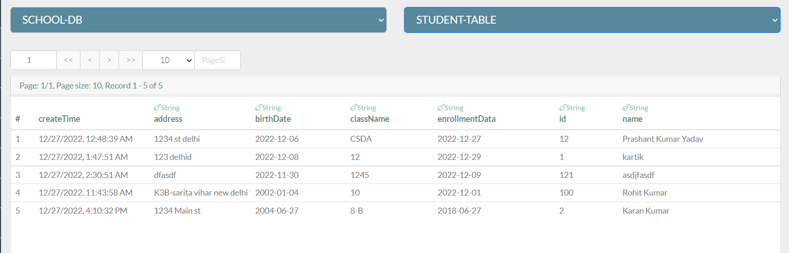

# Illustrations:
* **UPDATE** : when student roll number is already present in database then student information is fetched from database and filled in respective feild then user can UPDATE student information 
* **SAVE** : If student roll number is not existed in database then we can fill other field and save in database
* **clear** : By this we can clear all field of form and with this except first field (roll-no) other field are disabled until user enter any roll number
* **Alert** : This website uses disposable Alter prompt using bootstrap

# HOW TO USE

* **Initially**
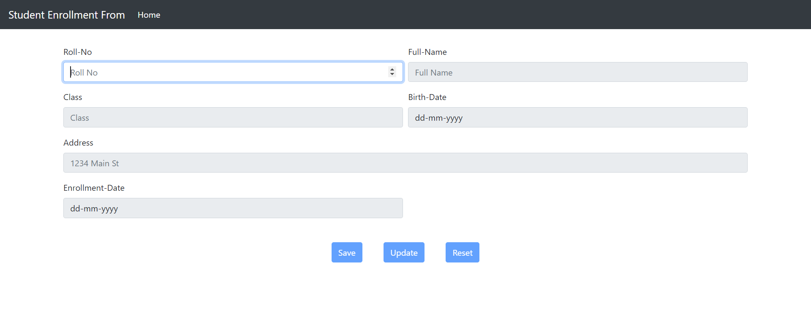

We need to enter a roll number 

If roll number is not valid 

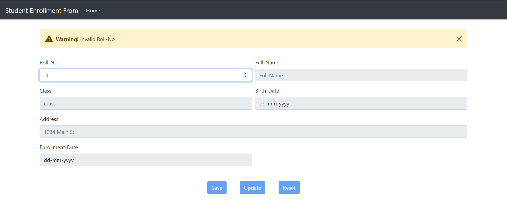

If roll number is valid and that roll number is existnig in database

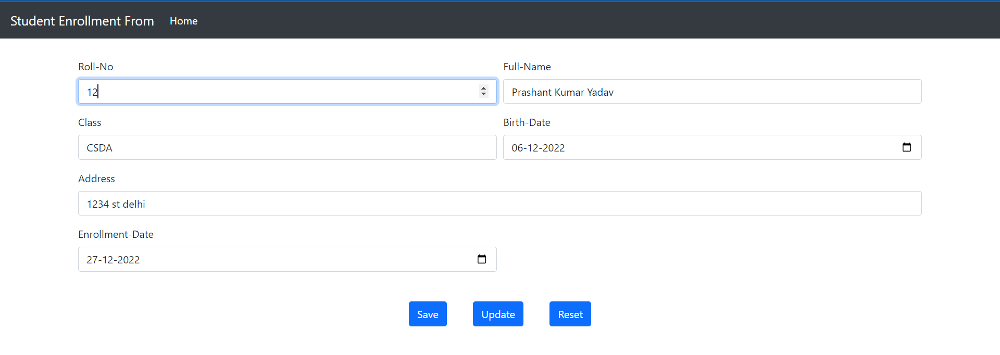

* **Fetching student data using roll number**
  If student already present in database, then all field filled with that student information
  
  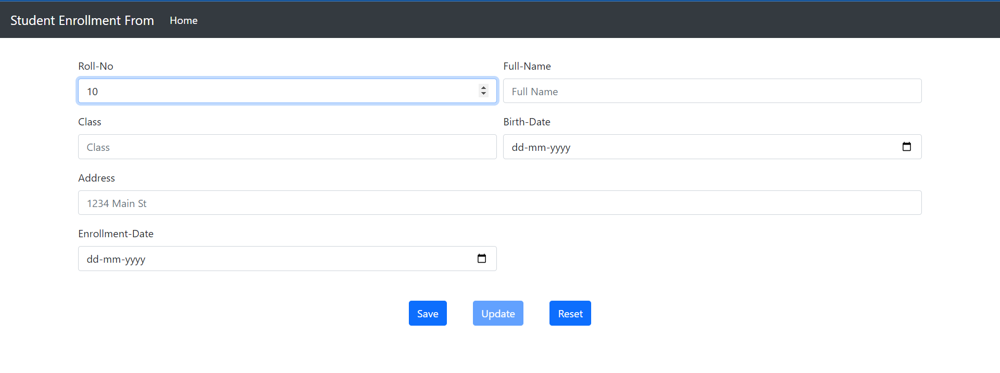
  otherwise, other fields are enabled after user input roll number
  
* **Updation of student details**
  In order to update student details input roll number, and then we can update the student data
  
  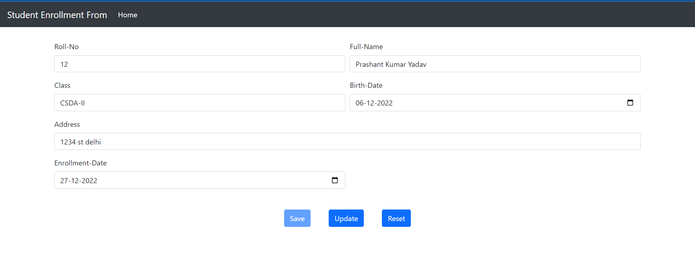
  
  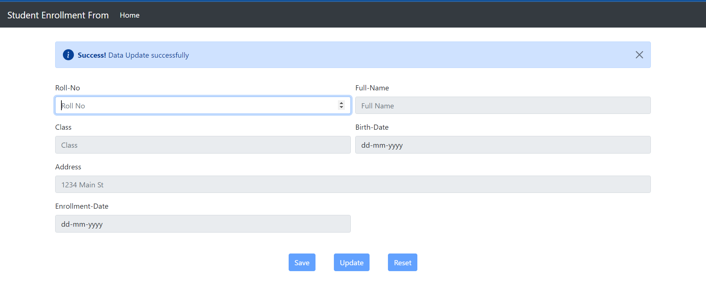

* **Adding new student data**

  Enter new roll number and then all other fields are enabled and then after filling student information we can save this data into database only if input is valid
  
  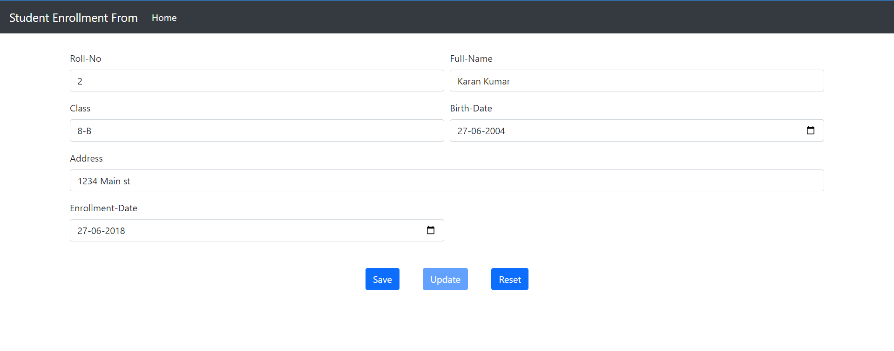
  
  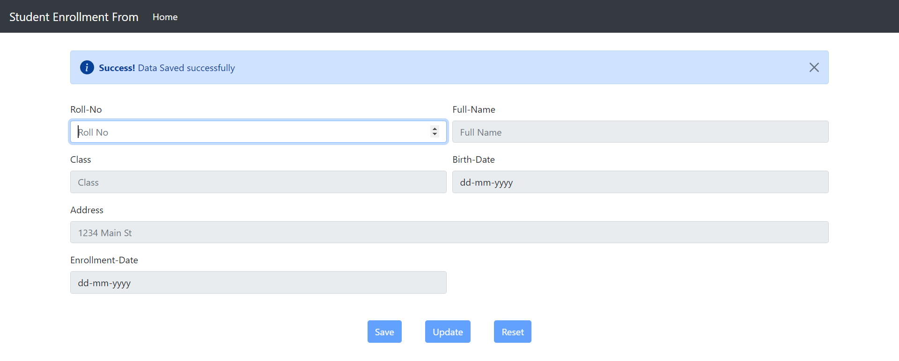
  
 * **If input data is not valid**
 
   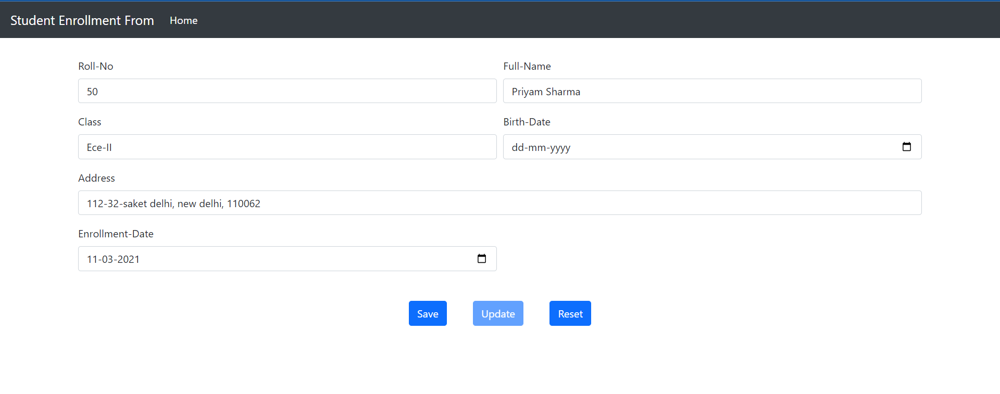
  
   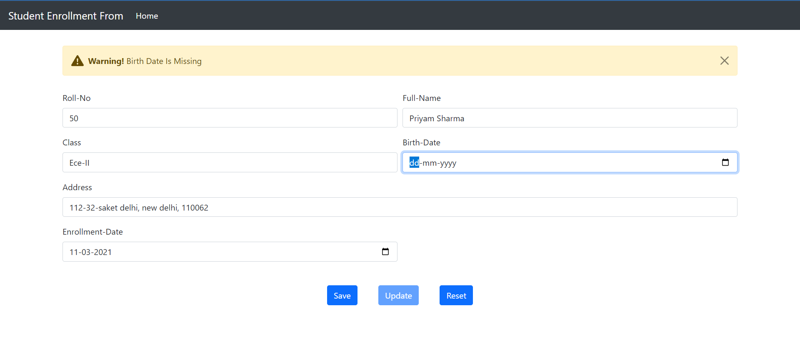

    
  
  # Installation
  
  Make a folder in your system and clone the project using git bash then open the project in Visual Studio Code or any IDE you prefer.
  ##### Clone the project 
  ```
  git clone https://github.com/prashant-smart/Recommendation-system.git
  ```
  After cloning 
  
  Move to **public_html** and then **script** folder and in **script.js** file replace the **connectionToken** by with your Connection Token
  
  # Sources
  * Introduction to JsonPowerDB - V2.0 course  on https://careers.login2explore.com/
  * [Bootstrap](https://getbootstrap.com/docs/5.0/getting-started/introduction/) 
  

  # Demo
  
  https://user-images.githubusercontent.com/72729279/209667623-a34280bf-97cd-4eae-9584-b5022ea194bc.mp4
  

  --------------------
## Hope You Like the Project ❤️❤️❤️
## Peace to everyone 🙏🏻
